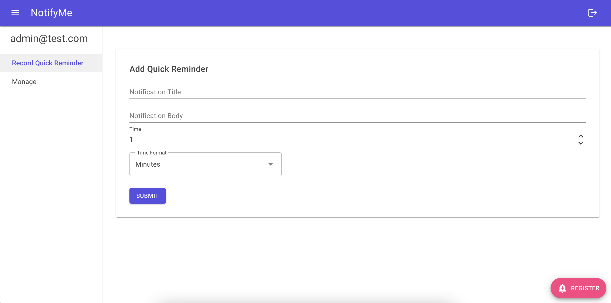

# NotifyMe.App - An Open Source, Self-Hostable, And Cross-Platform Notifications Solution

<!-- vscode-markdown-toc -->
* 1. [Introduction](#Introduction)
* 2. [Architecture](#Architecture)
  * 2.1. [Reusability](#Reusability)
  * 2.2. [Notification Scheduling](#NotificationScheduling)
  * 2.3. [Databases and Storage](#DatabasesandStorage)
  * 2.4. [Authentication and Authorization](#AuthenticationandAuthorization)
  * 2.5. [User Interface](#UserInterface)
  * 2.6. [TypeScript Integration](#TypeScriptIntegration)
* 3. [Creating and Updating Migrations](#CreatingandUpdatingMigrations)

<!-- vscode-markdown-toc-config
	numbering=true
	autoSave=true
	/vscode-markdown-toc-config -->
<!-- /vscode-markdown-toc -->



## 1. <a name='Introduction'></a>Introduction

NotifyMe.App is a blazor server app that is focused on providing a self-hostable open source solution that allows users to save and schedule notifications that can be sent to any device which supports web push notifications.

It also demonstrates how a more complicated progessive web application can be created using Blazor that interops with modern TypeScript/JavaScript web functionality that can't be done in pure C#.

The app is currently in active development, with the intention of integrating with the Pushy.App web API to support iOS devices.

You should be able to clone the repository and then within the notifyme.server project create a `appsettings.Development.json` file and include the following snippet (replacing any secrets):

```json
{
  "DetailedErrors": true,
  "Logging": {
    "LogLevel": {
      "Default": "Information",
      "Microsoft": "Warning",
      "Microsoft.Hosting.Lifetime": "Information"
    }
  },
  "AllowedHosts": "*",
  "VAPID": {
    "subject": "{VAPIDSUBJECTSECRET}",
    "publicKey": "{VAPIDPUBLICKEY}",
    "privateKey": "{VAPIDPRIVATEKET}"
  },
  },
  "ConnectionStrings": {
    "NotifyMeDB": "{NOTIFYMEDBCONNECTIONSTRING}"
  },
  "Quartz": {
    "SQLiteDataSourcePath": "Data Stores/jobstore.db",
    "SQLiteDataSourceTemplatePath": "../notifyme.scheduler/DB Templates/jobstore-template.db",
    "quartz.scheduler.instanceName": "NotifyMeScheduler",
    "quartz.threadPool.maxConcurrency": "3",
    "quartz.serializer.type": "json",
    "quartz.jobStore.type": "Quartz.Impl.AdoJobStore.JobStoreTX, Quartz",
    "quartz.jobStore.misfireThreshold": "60000",
    "quartz.jobStore.lockHandler.type": "Quartz.Impl.AdoJobStore.UpdateLockRowSemaphore, Quartz",
    "quartz.jobStore.useProperties": "true",
    "quartz.jobStore.dataSource": "jobstore",
    "quartz.jobStore.tablePrefix": "QRTZ_",
    "quartz.jobStore.driverDelegateType": "Quartz.Impl.AdoJobStore.SQLiteDelegate, Quartz",
    "quartz.dataSource.jobstore.connectionString": "Data Source=Data Stores/jobstore.db;Version=3;Foreign Keys=ON;",
    "quartz.dataSource.jobstore.provider": "SQLite"
  }
}
```

The app should be configured to use a SQLite DB for both the Quartz.NET job store and for the NotifyMe apps database. On running the app for the first time both databases will be created automatically and migrations will be applied.

Make sure that the "SQLiteDataSourcePath" configuration in the Quartz section of `appsettingss.Development.json` matches the connection string in "quartz.dataSource.jobstore.connectionString".

The NotifyMeDB will be seeded with with an admin user with the login:
UserName: admin@test.com
Email: admin@test.com
Password: Ch@ngeMe1!

You can change this, but as this is for development only it shouldn't matter.

You should be able to run the NotifyMe app, login, and start using it.

## 2. <a name='Architecture'></a>Architecture

The app has been architectured attempting to follow the best practices outlined for ASP.NET and Blazor applications, and mirrors [how other sample applications have been setup](https://github.com/dotnet-architecture/eShopOnWeb).

The app uses the MVVM design pattern along with the built in dependency injection provided by ASP.NET and so shouldn't be too difficult to follow.

### 2.1. <a name='Reusability'></a>Reusability

A lot of the code for this project is within the notifyme.shared project which is a .NET Standard project, and so can be reused. The ViewModel code and service interfaces are all defined here.

### 2.2. <a name='NotificationScheduling'></a>Notification Scheduling

The app uses Quartz.NET to schedule jobs that when ran will push saved notifications to all the users registered browsers any their devices, the notifyme.scheduler project demonstrates how this is done, and is sandboxed into using its own database.

### 2.3. <a name='DatabasesandStorage'></a>Databases and Storage

The app uses Entity Framework Core for data storage, and for development is configured using SQLite. Realistically as the userbase for a self hosted app should be small, the production application could also be configured using SQLite.

### 2.4. <a name='AuthenticationandAuthorization'></a>Authentication and Authorization

The app uses ASP.NET Core Identity for user management as this integrates well with Blazor. The identity database is set to be the same as the current development database (`NotifyMeDB.db`) to keep it simple.

### 2.5. <a name='UserInterface'></a>User Interface

The UI is designed using the [MudBlazor library](https://mudblazor.com/). Common UI elements should be broken down into components, and are stored within the Shared directory in the notifyme.server project.

### 2.6. <a name='TypeScriptIntegration'></a>TypeScript Integration

The application is setup to use TypeScript, which on each build converts and deploys any TypeScript code in the `notifyme.server/Scripts` directory into `notifyme.server/wwwroot/js`. The relevant JavaScript functions can then be called using JSInterop in Blazor.

The TypeScript required for the project should be kept to a minimum and should be organized into modules, like how it is done within `PushNotification.ts`.

## 3. <a name='CreatingandUpdatingMigrations'></a>Creating and Updating Migrations

from the notifyme.server directory run:

`dotnet ef migrations add MIGRATIONAME --context notifymecontext -p ../notifyme.infrastructure/notifyme.infrastructure.csproj -s notifyme.server.csproj -o Data/Migrations`

`dotnet ef database update --context notifymecontext -p ../notifyme.infrastructure/notifyme.infrastructure.csproj -s notifyme.server.csproj`
